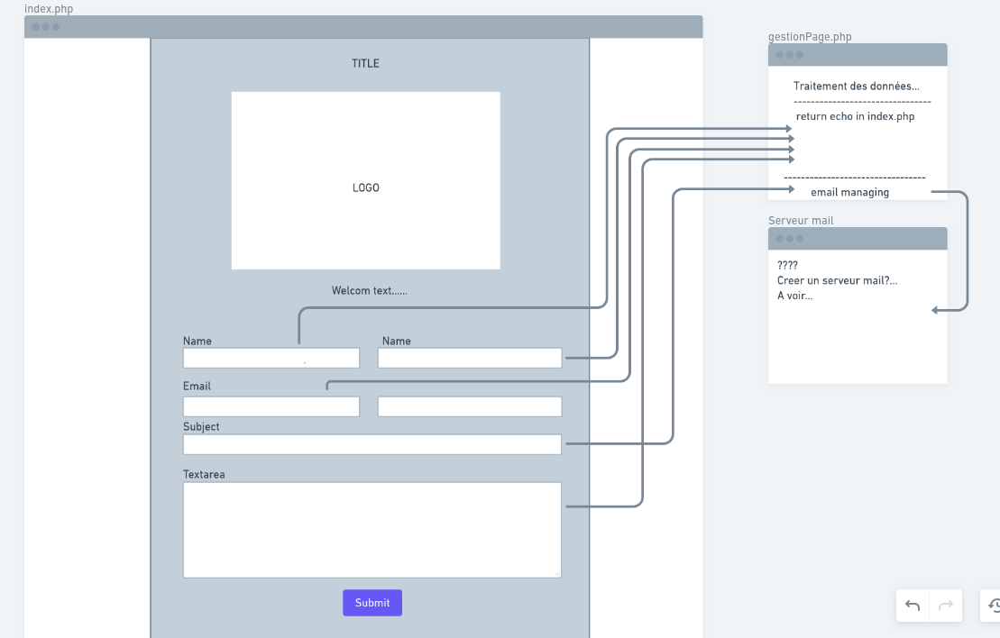

# Hacker Poulette From

Exercise on the creation of a form with Bootstrap and its sanitation + hosting and SMTP server

## Setting up the working method as well as visualization

For the method of work I used the site https://whimsical.com which allows to make a quick diagram of the layout as well as the preview of the logic itself.

  

### What I need

As it is a form, I need to visualize its appearance and the creation of html attributes that will be transformed into variables later. Bootstrap is all about doing this quickly and focuses on php logic.```


Once done I will have to recover the variables of my form and processed them so that a user can not introduce what he wants (javascript injection, mysql injection), send an error message if the data entered are bad and if all that is good, send the email.

###Author 

Vanderschrieck Arnaud.


###Acknowledgment

Thank you to my coach and Becode.
